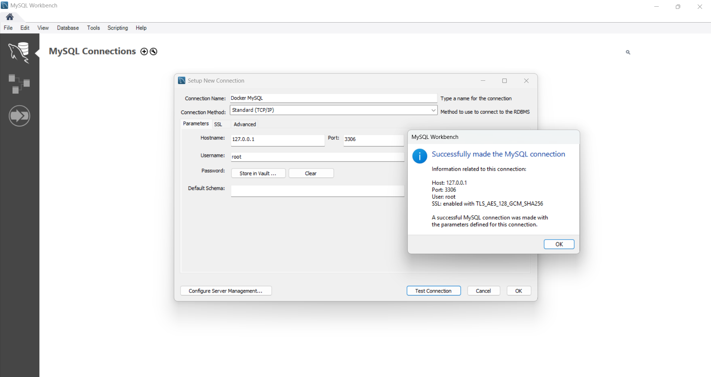
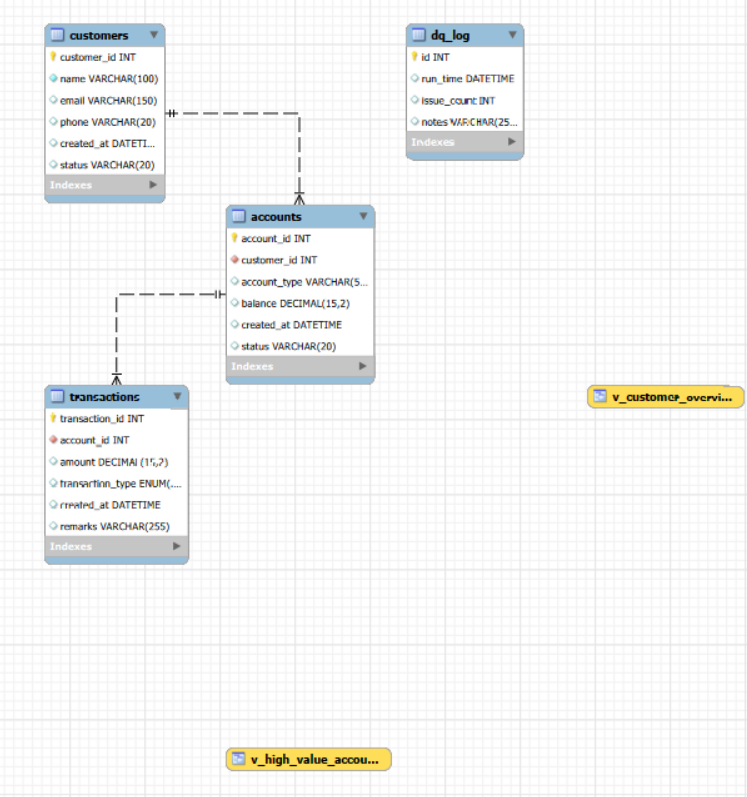

# SQL-Driven Data Workflow & Automation System

A complete end-to-end SQL automation project featuring stored procedures, views, CTE-based reports, indexing optimization, error handling, and automated data quality checks.

This project was designed to simulate a real enterprise SQL environment—similar to workflows used in banking, fintech, risk management, and data engineering teams (e.g., HSBC, JPMC, Barclays, Citi).

---

## 🚀 Project Features

### 🔹 1. Database Schema
- `customers`  
- `accounts`  
- `transactions`  
- `dq_log` (Data Quality Log Table)

### 🔹 2. Stored Procedures
- `add_transaction()` — Validations + business logic + error handling  
- `data_quality_check()` — Automated DQ scan + logging  

### 🔹 3. Views
- `v_customer_overview` — customer → accounts → transaction summary  
- `v_high_value_accounts` — accounts with high monthly volume  

### 🔹 4. CTE Reports
- Monthly transaction summary  
- Last 30-day heavy activity  

### 🔹 5. Error Handling
- TRY/CATCH  
- SIGNAL for validation  
- Logging failed quality checks  

### 🔹 6. Query Optimization
- Before vs After EXPLAIN plans  
- Indexing strategies  
- Refactored nested queries  

### 🔹 7. Automation
- MySQL Event Scheduler  
- Daily DQ job inserted into `dq_log`

---

## 🏗️ Project Structure

```
SQL-Data-Workflow-Automation/
│── schema.sql
│── sample_data.sql
│── views.sql
│── stored_procedures.sql
│── ctes.sql
│── automation_scripts.sql
│── optimization.sql
│── error_handling.sql
│── run_all.sh
│── assets/
│   └── screenshots/
```

---

## 🐳 Run the Project Using Docker

### 1. Start MySQL Container
```bash
docker run --name mysql-wf -e MYSQL_ROOT_PASSWORD=pass123 -p 3306:3306 -d mysql:8.0
```

### 2. Copy Project Files to Container
```bash
docker cp . mysql-wf:/sql/
```

### 3. Enter Container
```bash
docker exec -it mysql-wf bash
```

### 4. Run All SQL Scripts
```bash
cd /sql
chmod +x run_all.sh
./run_all.sh
```

---

## 📸 Screenshots (Proof of Working System)

### 1. MySQL Workbench Connection


### 2. SHOW DATABASES


### 3. Schema Expanded


### 4. SHOW TABLES


### 5. Table Previews

#### Customers


#### Accounts


#### Transactions


### 6. View Outputs

#### v_customer_overview


#### v_high_value_accounts


### 7. CTE Reports

#### Monthly Summary


#### Last 30 Days


### 8. Stored Procedure Execution

#### Valid Transaction


#### Invalid Transaction (error handling)


### 9. Data Quality Automation

#### Running DQ Check


### 10. Query Optimization

#### Before Indexing (slow query)


#### After Indexing


#### SHOW INDEX


### 11. Automation (Event Scheduler)


### 12. ER Diagram (Workbench Reverse Engineering)


---

## 📘 Skills Demonstrated

✅ SQL (T-SQL-like patterns adapted for MySQL)  
✅ Stored Procedures  
✅ Views & CTEs  
✅ Data Quality Framework  
✅ Performance Optimization  
✅ Automation (Event Scheduler)  
✅ Containerized SQL Development (Docker)  
✅ Enterprise-style data modeling  

### Perfect for roles such as:
- SQL Developer
- Data Engineer
- Consultant Specialist (HSBC)
- BI Developer
- ETL Developer
- Database Engineer

---

## ✨ Author

**Priyangkush Debnath**  
SQL • Data Engineering • Backend Development • Automation
